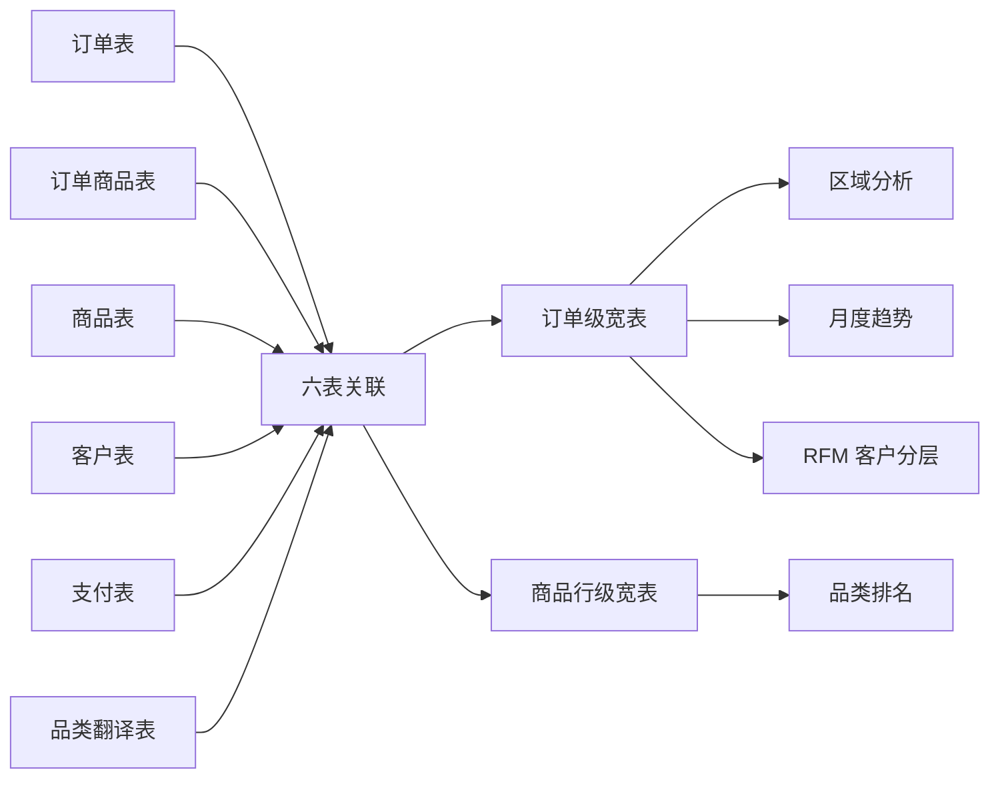

# 项目案例研究：PySpark 电商经营分析与 RFM 客户分层

## 一、业务问题

电商平台的订单、客户、商品、支付和品类信息分散在多张表中。直接按订单金额或商品行汇总，很容易得到互相矛盾的结果：

- 区域 GMV 和多商品订单支付额可能重复计算。
- `customer_id` 是一次性订单标识，用它计算复购率会严重失真。
- 频次高度集中在 1 次时，直接 `ntile` 会随机拆分同值客户。
- 首尾不完整月份会让环比增长率出现虚假波动。

本项目使用 Olist 公开数据集和 PySpark，将数据清洗、指标口径、区域分析、趋势分析、品类排名和 RFM 分层串成可复现的六步分析流程。

## 二、数据与分析链路

数据目录不随仓库提交，约 21 MB 的原始压缩包需要从 Kaggle 下载。仓库保留 `analysis.py`、`visualize.py`、requirements、分析结果 CSV 和图表输出。

## 三、指标口径设计

### 双层粒度

| 宽表 | 粒度 | 用途 |
|---|---|---|
| 订单级宽表 | 一行一订单 | 区域 GMV、月度趋势、RFM |
| 商品行级宽表 | 一行一订单商品 | 品类 GMV 和件均价 |

区域、趋势和 RFM 使用支付金额按订单聚合后的结果；品类分析使用 `price + freight_value` 的商品行金额。两个口径不能混用，否则多商品订单会被重复累加。

### 时间与金额清洗

- 时间戳同时兼容 `yyyy-MM-dd` 和 `yyyy/MM/dd`。
- 只保留 `delivered`、`shipped`、`invoiced` 等有效订单状态。
- 过滤不在 1–10000 BRL 范围内的异常支付金额。
- 月度趋势剔除订单量过低的非完整月份，再重新计算环比。

## 四、RFM 分层方法

- 以真实客户 `customer_unique_id` 聚合，而不是订单级 `customer_id`。
- R 和 M 使用 `ntile(4)` 四分位打分。
- F 维度的复购人数很少，直接 `ntile` 会拆散同为 1 次的客户，因此改用阈值：≥4 次为 4 分，≥3 次为 3 分，≥2 次为 2 分，否则为 1 分。
- 根据 R/F/M 总分划分为高价值客户、重要客户、一般客户和低价值客户。

## 五、核心结果

### 区域集中

- 圣保罗州（SP）GMV 约 585 万 BRL、约 4.1 万单，是第二名里约州（RJ，209 万 BRL）的约 2.8 倍。
- 头部三州贡献全平台约 62% 营收，说明物流、营销和库存策略需要优先考虑区域集中度。

### 品类结构

- 健康美妆 GMV 约 144 万 BRL，排名第一。
- 手表礼品 GMV 约 129 万 BRL，件均价约 218 BRL，是典型的高客单品类。
- 床品卫浴 GMV 约 124 万 BRL，位列前三。

### 趋势

- 2017 年 11 月黑五单月 GMV 约 116.7 万 BRL，是明显的峰值月。
- 2018 年稳定在月均 100 万 BRL 以上，客单价约 160 BRL。

### 客户留存

- 以 `customer_unique_id` 识别约 9.47 万名真实客户。
- 复购率约 3.0%，说明平台增长更依赖拉新而不是存量复购。
- RFM 中高价值客户约 603 人，平均消费约 436 BRL；低价值客户平均约 57 BRL，差距超过 7 倍。

这些数字描述的是数据集中的历史结构和相关关系，不是对当前 Olist 经营状况的判断，也不等价于因果结论。

## 六、工程实现亮点

- 使用 Spark SQL 和 DataFrame API 完成六表关联，避免把大规模数据拉到 Pandas 再分析。
- 使用窗口函数 `lag` 计算月度环比，并用订单量阈值剔除不完整月份。
- 通过订单级和商品行级两张宽表解决 GMV 口径冲突。
- 将清洗过滤数量、订单数和支付异常数量打印出来，形成可检查的运行日志。
- 图表脚本与 Spark 分析脚本解耦，便于在不启动 Spark 的情况下重新生成可视化。

## 七、当前边界

- 数据时间范围是 2016–2018，无法代表当前市场。
- RFM 只覆盖有有效订单记录的客户，未纳入退款、客服和营销曝光数据。
- 复购率低是数据事实，项目没有进一步区分品类属性、客户生命周期和平台策略的影响。
- 项目验证的是可复现分析流程和口径设计，不是生产级数据仓库或实时计算平台。

## 八、面试讲解框架

### 为什么要用两张宽表？

订单级和商品行级不是同一种分析粒度。区域 GMV 和 RFM 关心订单，品类 GMV 和件均价关心商品行；强行使用一张表会造成支付金额、数量和客单价的重复计算。

### 为什么 RFM 的 F 不用 ntile？

Olist 大多数客户只购买一次，`ntile` 会把相同 F 值的客户随机分配到不同分数，制造没有业务含义的差异。阈值打分更稳定，也能准确表达复购行为。

### 为什么复购率只有 3% 仍然值得分析？

低复购本身就是一个经营规模信号。它提示需要进一步区分一次性品类、客户生命周期和平台留存策略，而不是直接把“复购低”解释为产品或服务问题。

## 九、简历可复用表述

- 使用 PySpark 处理 Olist 六表数据，构建订单级和商品行级双层宽表，解决区域 GMV、品类 GMV 和客单价的口径冲突。
- 实现区域、月度趋势、品类排名和 RFM 客户分层，识别头部三州约 62% 营收集中和平台约 3.0% 的复购率。
- 针对复购高度集中于一次的问题，放弃 F 维度 `ntile`，改用阈值打分，避免把同值客户随机拆分。
- 使用窗口函数、时间戳兼容解析和异常金额过滤搭建可复现分析流程，并输出可视化图表和分析结果 CSV。

## 十、后续演进

1. 增加客户生命周期、首购品类和复购间隔分析。
2. 将订单级和商品级指标迁移到数据仓库模型，并补充数据质量测试。
3. 对渠道、促销和物流时效等变量做更严格的因果或分层分析。
4. 增加 Spark 单元测试和固定样本数据，验证每个指标口径。