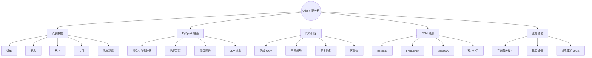
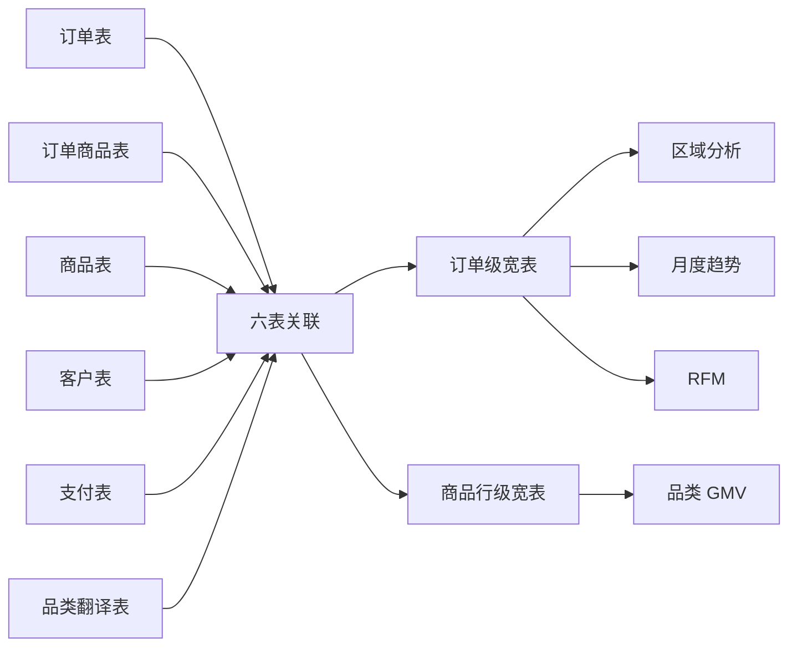
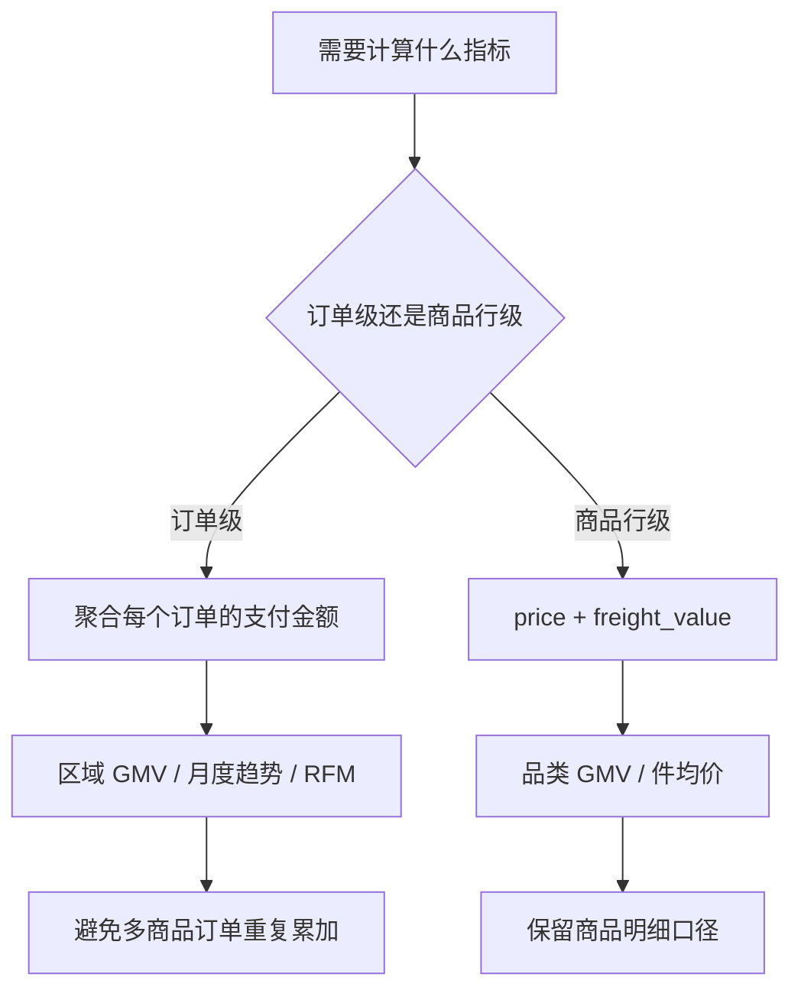
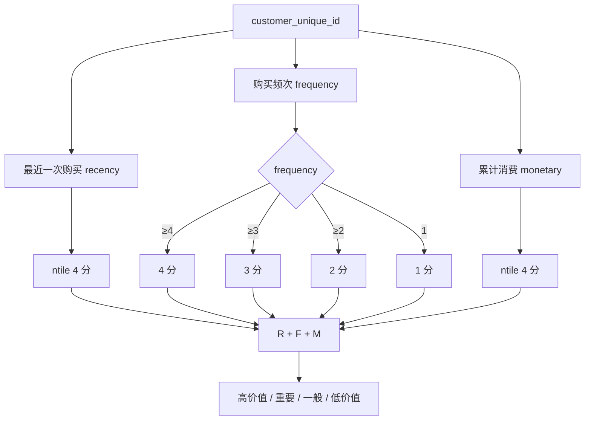
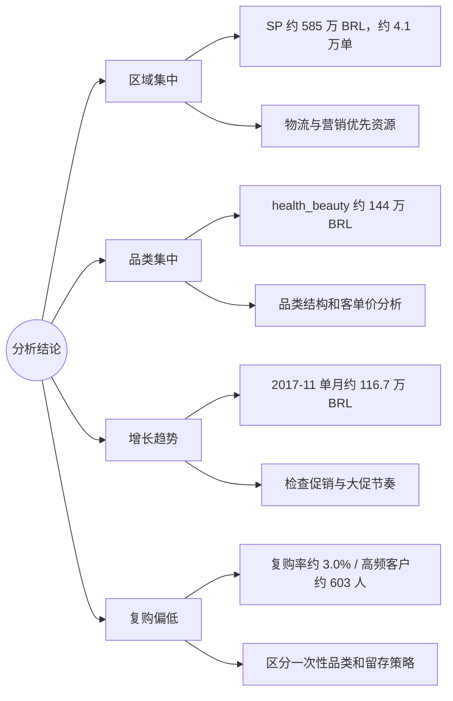
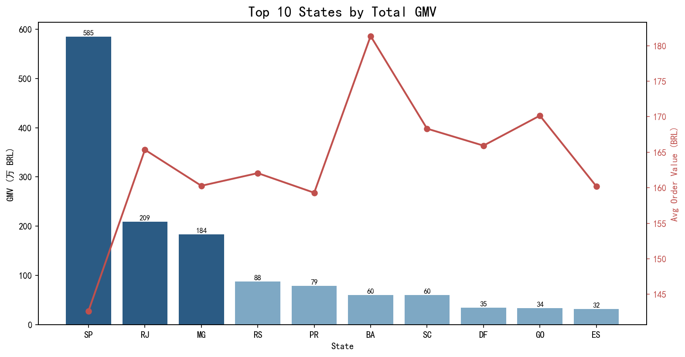
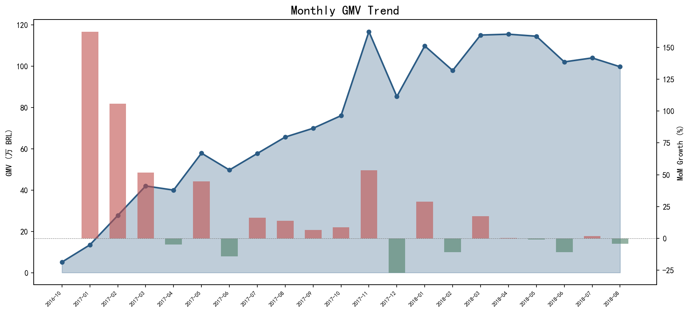
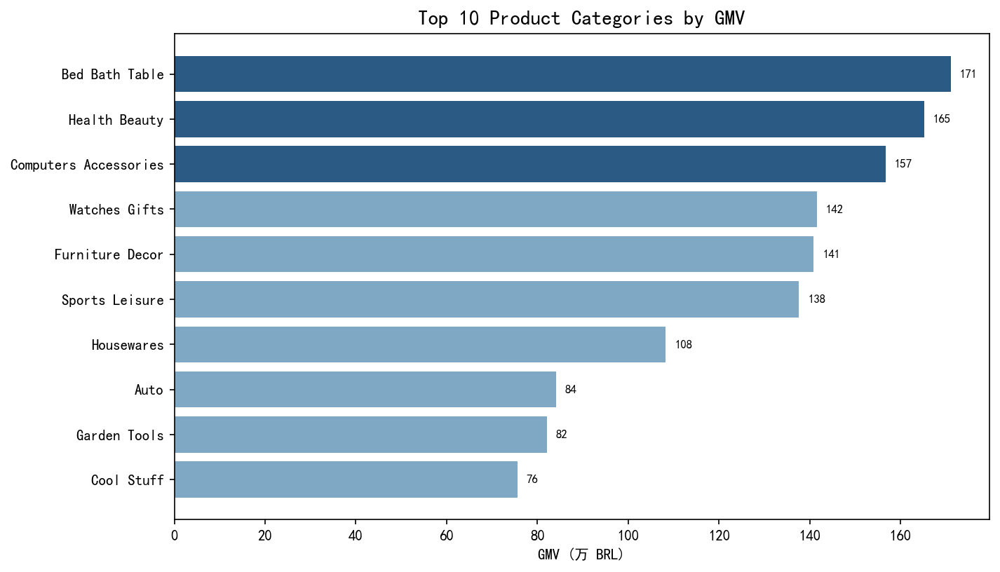
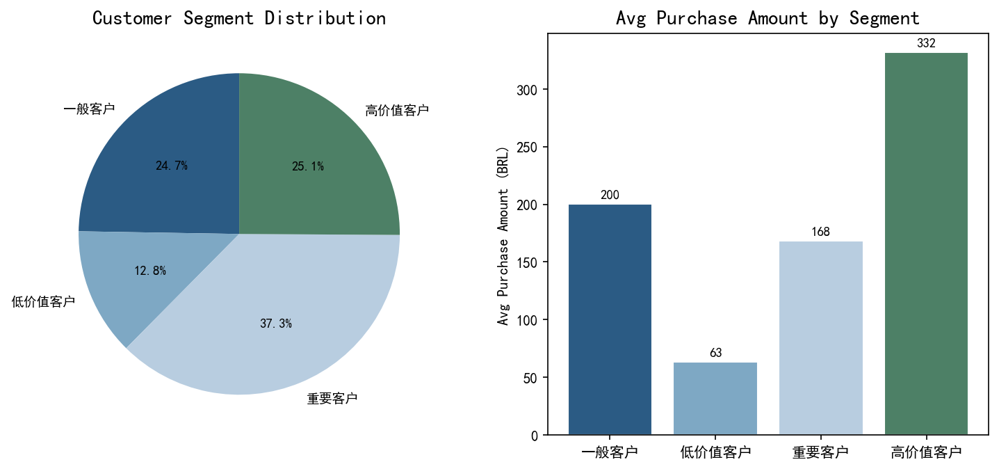

# 项目可视化与可解释性指南

本页用思维导图、数据流、指标口径、RFM 决策逻辑、业务结论图和现有分析图表解释 PySpark 电商项目。

## 图 1：项目能力思维导图

## 图 2：六表关联与双层宽表

关键解释：区域、趋势和 RFM 以订单为粒度；品类 GMV 以商品行为粒度。两张表可以共享清洗逻辑，但不能混用金额。

## 图 3：GMV 口径决策树

## 图 4：RFM 打分与分层逻辑

Frequency 不能直接 `ntile` 的原因是大量客户同为 1 次购买，强制分箱会把相同行为随机拆开。

## 图 5：业务结论与证据地图

## 既有分析图表

### 区域 GMV Top 10

解释：识别营收集中在哪些州，以及平均客单价和订单规模是否存在区域差异。

### 月度趋势

解释：观察大促、季节性和环比波动，重点区分真实增长和低基数噪声。

### 品类排名

解释：用商品行级 GMV 和件均价识别高收入、高单价品类。

### RFM 客户分层

解释：识别高价值、重要、一般和低价值客户的数量与消费贡献。

## 视觉阅读顺序

1. 图 1 了解项目模块。
2. 图 2 理解六表关联和双层宽表。
3. 图 3 解释 GMV 口径。
4. 图 4 说明 RFM 为什么采用混合打分。
5. 图 5 和四张图表用于解释结论、指标和行动建议。